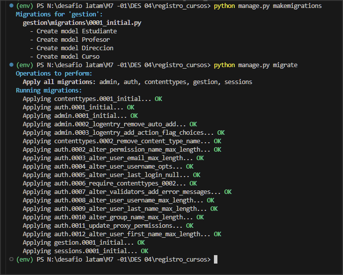
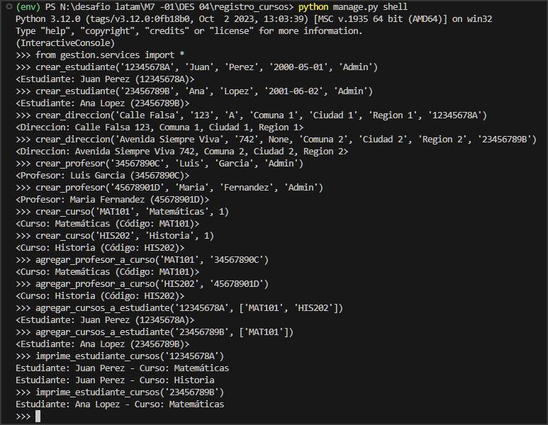

# Desafío Evaluado - Registro de Cursos

Este proyecto es un desafío evaluado para la administración de cursos en una institución educativa. El sistema permite gestionar estudiantes, profesores, cursos y sus respectivas relaciones, proporcionando funcionalidades básicas para la manipulación de estos datos.

## Descripción

El proyecto consiste en desarrollar un sistema simplificado para la administración de cursos, incluyendo la creación de modelos con relaciones y servicios para operar sobre los datos ingresados. 

## Modelos

Detalles de los modelos `Estudiante`, `Profesor`, `Curso`, `Direccion` e `Inscripcion` con sus relaciones.

## Pruebas

Instrucciones para realizar pruebas y verificar el funcionamiento del proyecto.

